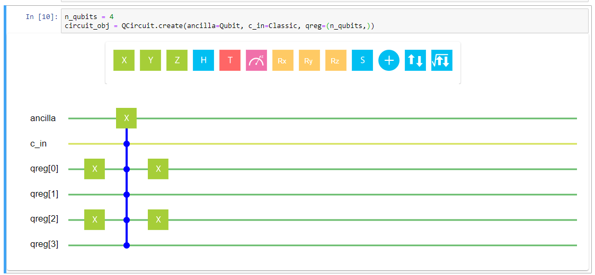
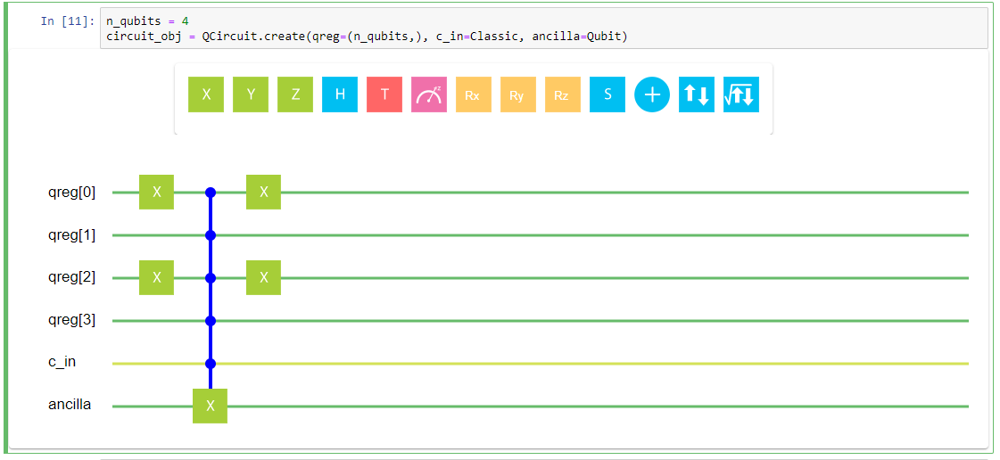

# hiq-jupyter Plug-in

## Installation

1. Clone repository and go inside
2. For Windows: run Anaconda in administrator mode (because plug-in requires access to "C:\ProgramData\jupyter\nbextensions")
3. Run `python ./setup.py install`
4. Run `python ./setup.py develop`

## Usage

```
from qcircuit import QCircuit, Classic, Qubit, Qureg
```

```
n_qubits = 4
circuit_obj = QCircuit(qncilla=Qubit, c_in=Classic, qreg=(n_qubits, ))
circuit_obj
```


Using mouse draw any circuit schema with UI




Try to change circuit parameters order or add/delete some or change QuReg size to see updated circuit


